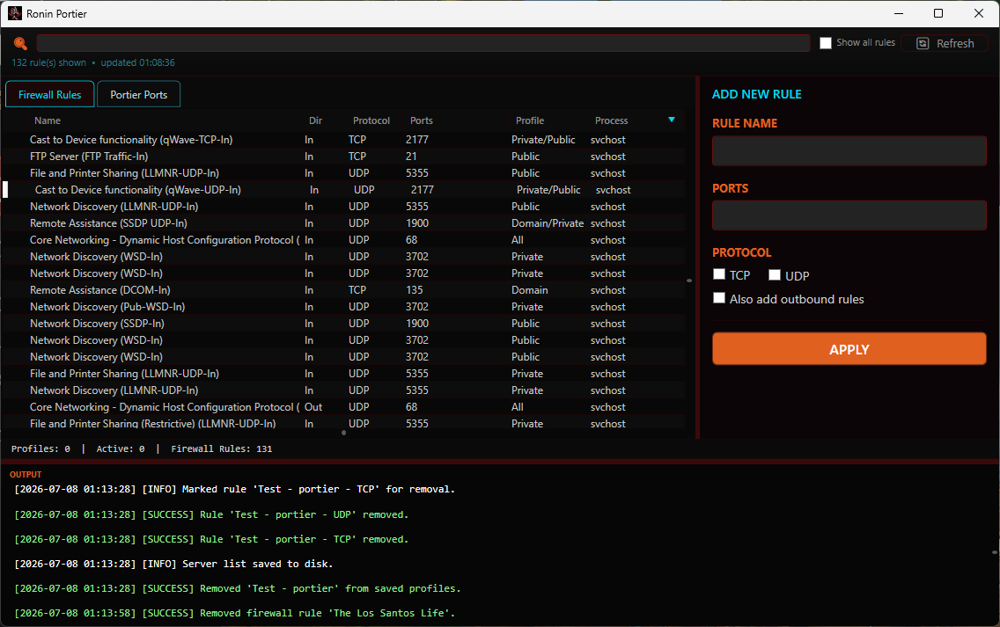

# Ronin Portier 🏯
**A lightweight, open-source Windows Firewall manager for easily opening and closing ports as needed.**

Ronin Portier was built to simplify the process of opening, closing and managing firewall rules for admins, specifically tailored for ease of use and little overhead. It lets you save server profiles, browse and search every rule already on your system, see what's actually running on a given port, and open or close ports at the click of a button.

While this can be used and was primarily built to simplify the set-up for game servers, it can just as easily be used for any application that requires specific ports to be opened on the firewall, such as web servers, database servers, or any custom applications.

---

## 📋 Requirements
* **OS:** Windows 10 or later
* **Permissions:** Must be run as Administrator to read and modify Windows Firewall rules

---

## 🚀 Quick Start
1. **Download:** Go to the [Releases](https://github.com/PhonicSpider/Ronin-Portier/releases/latest) page and download the latest `Ronin_Portier_V*.zip`.
2. **Extract:** Unzip the contents to a folder of your choice.
3. **Run as Admin:** Right-click `Ronin Portier.exe` -> **Run as administrator**. Click **YES** on the UAC prompt and enjoy.
    * *Note: Administrative privileges are required to read and modify Windows Firewall rules.*
    * *This is a self-contained build - no .NET Runtime install needed. Keep every file in the extracted folder together.*

---

## 🛠 Features
* **Firewall Rules browser:** See every Windows Firewall rule on your system in one grid - name, direction, protocol, ports, profile, and (if something's listening) the live process using that port. Disabled and wildcard/no-port rules are hidden by default; a "Show all rules" toggle reveals everything.
* **Portier Ports tab:** A separate view scoped to just the profiles Portier itself manages, so your own game-server rules don't get lost in the noise of every other rule on the system.
* **Search:** Find a rule by name, by a specific port number (even one buried inside a range like `27015-27030`), or by the name of whatever process is currently using a port.
* **Live port-to-process lookup:** See which running program is actually bound to a port, refreshed on load or with the Refresh button.
* **Smart Port Entry:** Supports single ports (`27016`), comma-separated lists (`27016,27017`), and ranges (`27015-27030`).
* **Protocol Support:** Toggle TCP, UDP, or both, plus an optional matching outbound rule.
* **Port conflict detection:** Warns you before applying if your ports overlap with an existing rule Portier doesn't own.
* **Duplicate Profile:** Clone a saved profile with one click.
* **Foreign rule management:** Select a rule Portier didn't create to inspect it, use it as a template for a new profile, or remove it - removal always asks for confirmation and tells you which process (if any) will be affected.
* **Console Logging:** Real-time, color-coded log of every action taken.

---

## 📖 How to Use
1. **Add a rule:** With nothing selected, the right panel shows **Add New Rule** - enter a name and ports, pick TCP/UDP (and outbound if needed), then **Apply**.
2. **Edit or remove a saved profile:** Switch to the **Portier Ports** tab and select a row - the panel becomes an editable form with **Remove** and **Duplicate Profile** buttons.
3. **Browse everything on the system:** The **Firewall Rules** tab lists every rule Windows knows about. Selecting a rule Portier doesn't own shows a read-only inspector with **Use as Template** and **Remove** options.
4. **Search:** Type a rule name, a port number, or a process name into the search bar at the top to filter whichever tab is active.

---

## 💻 Contributing
Community contributions are welcome! If you have ideas for new features (like auto-detecting running processes or remote server management), feel free to:
1. **Fork** the project.
2. Create your **Feature Branch** (`git checkout -b feature/AmazingFeature`).
3. **Commit** your changes (`git commit -m 'Add some AmazingFeature'`).
4. **Push** to the Branch (`git push origin feature/AmazingFeature`).
5. Open a **Pull Request**.
6. Discuss and collaborate on your changes with the community.

---

## ⚖️ License
This project is licensed under the **GNU General Public License v3.0**.

**What this means for you:**
* **Permissions:** You are free to download, modify, and redistribute this software.
* **Conditions:** If you distribute a modified version of this software, you **must** also make your source code available under the GPLv3.
* **Warranty:** This software is provided "as is," without warranty of any kind. 

For the full legal text, please see the [LICENSE](./LICENSE) file included in this repository.
